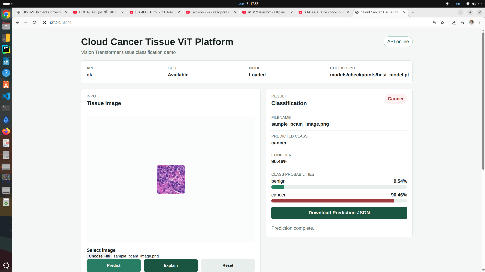
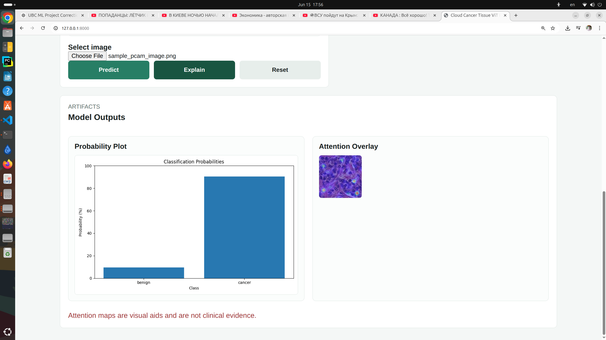

# Cloud Cancer Tissue ViT Platform

## 1. Project Overview

Cloud Cancer Tissue ViT Platform is a medical AI portfolio project for binary histopathology tissue classification using a **Vision Transformer ViT-B/16** model in **PyTorch**.

The project uses the **PCam Dataset** workflow for cancer tissue classification and includes model training utilities, evaluation metrics, a FastAPI inference service, explainable AI artifacts, a minimal static frontend, Docker support, and pytest tests.

The current inference workflow supports:

- Single image prediction
- Batch image prediction
- Explainable AI via attention overlay
- Probability plot generation
- Prediction JSON artifacts
- Browser-based demo through a lightweight HTML/CSS/JavaScript frontend

## 2. Features

- **ViT-B/16 classification** with TorchVision and PyTorch
- **PCam dataset pipeline** for histopathology image classification
- **Evaluation metrics** and saved evaluation outputs
- **FastAPI REST API** for inference
- **Single prediction** endpoint
- **Batch prediction** endpoint
- **Explainable AI** endpoint with attention overlay generation
- **Probability plot** artifact generation
- **Prediction JSON** artifact generation
- **Minimal frontend demo** without React or Node tooling
- **Docker support** for CPU-based API serving
- **Automated pytest tests**

## 3. Demo

### Prediction Interface

The frontend provides a simple browser interface for selecting a tissue image, previewing it, running prediction, and viewing class probabilities.



### Explainable AI

The `/explain` workflow generates a prediction and an attention overlay image. Attention maps are visual aids and are not clinical evidence.



## 4. Architecture

```text
Input tissue image
        │
        ▼
FastAPI upload endpoint
        │
        ▼
Image preprocessing
        │
        ▼
TorchVision ViT-B/16 classifier
        │
        ├── Prediction JSON
        ├── Probability plot
        └── Attention overlay (/explain)
        │
        ▼
Static frontend demo
```

The main API package lives under `src/api/`:

- `app.py` creates the FastAPI application and serves the static frontend and output artifacts.
- `routes.py` defines health, model status, prediction, batch prediction, and explainability endpoints.
- `model_loader.py` loads and caches the trained ViT model.
- `file_utils.py` handles uploaded image saving.
- `schemas.py` defines API response models.

## 5. API Endpoints

| Method | Endpoint | Description |
| --- | --- | --- |
| `GET` | `/` | Static frontend demo |
| `GET` | `/health` | API health and GPU availability |
| `GET` | `/model/status` | Model load status and checkpoint path |
| `POST` | `/predict` | Predict one uploaded image |
| `POST` | `/predict-batch` | Predict multiple uploaded images |
| `POST` | `/explain` | Predict one image and create an attention overlay |
| `GET` | `/outputs/...` | Serve generated artifacts |

Example single prediction:

```bash
curl -X POST http://127.0.0.1:8000/predict \
  -F "file=@outputs/predictions/sample_pcam_image.png"
```

Example explainability request:

```bash
curl -X POST http://127.0.0.1:8000/explain \
  -F "file=@outputs/predictions/sample_pcam_image.png"
```

## 6. Project Structure

```text
cloud-cancer-tissue-vit-platform/
├── configs/
│   ├── aws.yaml
│   ├── inference.yaml
│   └── train.yaml
├── docker/
│   ├── Dockerfile
│   └── docker-compose.yml
├── docs/
│   └── images/
├── frontend/
│   ├── app.js
│   ├── index.html
│   └── styles.css
├── scripts/
│   ├── download_pcam.py
│   ├── evaluate_model.py
│   ├── prepare_dataset.py
│   ├── run_api.sh
│   └── train.sh
├── src/
│   ├── api/
│   ├── aws/
│   ├── data/
│   ├── evaluation/
│   ├── models/
│   ├── training/
│   ├── utils/
│   └── visualization/
├── tests/
├── README.md
└── requirements.txt
```

Runtime artifacts are written under `outputs/`, including:

- `outputs/api_uploads/`
- `outputs/predictions/`
- `outputs/figures/`
- `outputs/attention_maps/`

Model checkpoints are expected under:

```text
models/checkpoints/best_model.pt
```

## 7. Installation

Create and activate a Python environment:

```bash
python -m venv venv
source venv/bin/activate
```

Install dependencies:

```bash
pip install -r requirements.txt
```

Prepare or download data as needed:

```bash
python scripts/download_pcam.py
python scripts/prepare_dataset.py
```

Train the model:

```bash
bash scripts/train.sh
```

Run evaluation:

```bash
bash scripts/evaluate.sh
```

## 8. Running the Frontend

Start the FastAPI service:

```bash
bash scripts/run_api.sh
```

Open the frontend:

```text
http://127.0.0.1:8000/
```

The frontend supports:

- Image upload
- Browser image preview
- Prediction
- Explainable AI attention overlay
- Probability bars
- Probability plot preview
- Prediction JSON download

The API must be able to load:

```text
models/checkpoints/best_model.pt
```

## 9. Docker

Build the CPU-only Docker image:

```bash
docker build -f docker/Dockerfile -t cloud-cancer-tissue-vit-api .
```

Run with Docker Compose:

```bash
docker compose -f docker/docker-compose.yml up --build
```

The compose setup mounts:

- `models/checkpoints/` into the container as read-only model checkpoints
- `outputs/` into the container for generated artifacts

Test the running service:

```bash
curl http://127.0.0.1:8001/health
```

The current compose file maps host port `8001` to container port `8000`.

## 10. Testing

Run API and project tests:

```bash
pytest -q
```

Run only API tests:

```bash
pytest tests/test_api.py -q
```

The test suite includes FastAPI endpoint tests and project-level pytest coverage.

## 11. Roadmap

### Completed

- ✅ ViT Classification
- ✅ FastAPI
- ✅ Batch Prediction
- ✅ Explainable AI
- ✅ Frontend Demo
- ✅ Docker
- ✅ PyTest

### Planned

- ⬜ AWS S3
- ⬜ AWS EC2
- ⬜ Whole Slide Images (WSI)
- ⬜ DICOM support
- ⬜ NIfTI support
- ⬜ Model Registry
